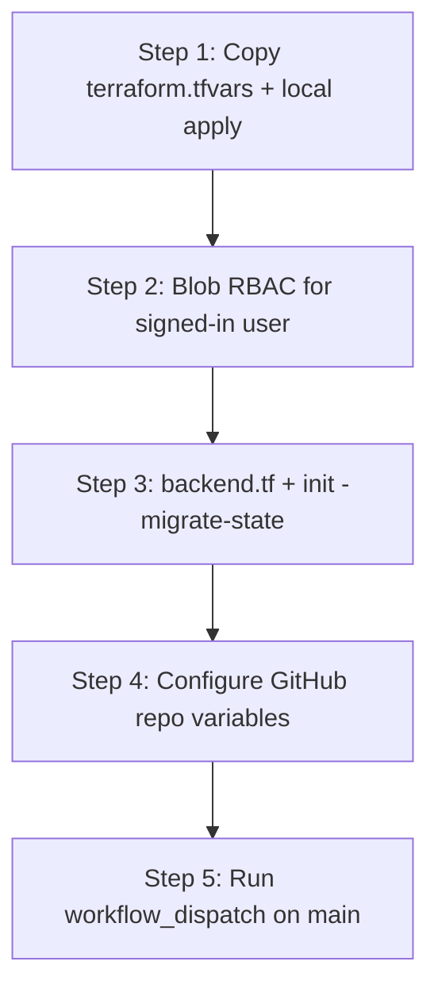

# terraform-infrastructure

[](LICENSE)

Bootstrap Terraform for Azure. This repository provisions the foundational resources that other Terraform workloads (including GitHub Actions pipelines) depend on before they can run safely with remote state and workload identity.

## Purpose

Most application or platform Terraform repos assume something already exists:

- An Azure Storage Account to store remote state
- A blob container for state files
- A user-assigned managed identity for deployments (typically from CI via OIDC)

This repo creates that foundation. It is the **first** Terraform stack you apply in a subscription/environment. Other repos then point their `backend "azurerm"` configuration at the storage account created here.

## What this stack creates

The `dev` environment currently provisions:

| Resource | Naming pattern | Purpose |
|----------|----------------|---------|
| Resource group | `rg-{github-repo-name}-{env}` | Container for bootstrap resources |
| Storage account | Derived from repo name + env (max 24 chars) | Remote Terraform state backend |
| Blob container | `tfstate` | Holds state files |
| User-assigned identity | `id-{github-repo-name}-{env}-deploy` | CI/CD deployments for this repo only |
| RBAC (Contributor) | Bootstrap resource group | Lets the deploy identity manage bootstrap resources |
| RBAC (Storage Blob Data Contributor) | `tfstate` container only | Lets the deploy identity read/write remote state (not the whole account) |
| Management lock (CanNotDelete) | State storage account | Blocks accidental deletion of the state account |
| Federated identity credential | On deploy identity | Lets GitHub Actions on `main` authenticate via OIDC |

The storage account enables blob versioning, change feed, and 30-day soft delete for blobs and containers.

### State storage security

The tfstate storage account is hardened for **Azure AD only** (managed identity / OIDC). Review `environments/dev/main.tf` before apply.

| Setting | Value | Purpose |
|---------|--------|---------|
| `shared_access_key_enabled` | `false` | No long-lived storage account keys; RBAC + Entra ID only |
| `default_to_oauth_authentication` | `true` | Prefer OAuth (Azure AD) over shared key for blob APIs |
| `https_traffic_only_enabled` | `true` | Encrypt data in transit |
| `min_tls_version` | `TLS1_2` | Reject older TLS |
| `allow_nested_items_to_be_public` | `false` | Block anonymous public blob access |
| `cross_tenant_replication_enabled` | `false` | Reduce cross-tenant data movement risk |
| `local_user_enabled` / `nfsv3_enabled` / `sftp_enabled` | `false` | Disable unused access methods |
| `infrastructure_encryption_enabled` | `true` | Second layer of encryption at rest |
| Container `container_access_type` | `private` | No public container ACL |
| Blob versioning + soft delete | enabled | Recovery from overwrite or accidental delete |
| `azurerm_management_lock` | `CanNotDelete` | Prevent deleting the state storage account by mistake |

**Backend requirement:** Local `backend.tf` and CI must set **`use_azuread_auth = true`** and **`use_oidc = true`** on the `azurerm` backend (see `backend.tf.example` and [backend docs](https://developer.hashicorp.com/terraform/language/settings/backends/azurerm)). The provider block uses the same OIDC settings. Use `az login` locally or `azure/login` + OIDC in GitHub Actions—not storage account keys.

**RBAC scope:** **Storage Blob Data Contributor** is assigned on the **`tfstate` container**, not the entire storage account, so the deploy identity cannot read unrelated blobs if they are added later.

**Networking trade-off (not implemented):** Stricter isolation would put the state storage account behind an **Azure Private Endpoint** and restrict access to your virtual network only. That is the preferred pattern for production state when traffic should never use the public internet.

This bootstrap does **not** configure that, because **GitHub-hosted runners** (the default for Actions) run outside your Azure network. They authenticate with OIDC and Azure AD, but they still reach Storage over its **public** HTTPS endpoint. A private endpoint is only reachable from inside a connected VNet (or on-premises via ExpressRoute/VPN), so hosted runners cannot use it without extra plumbing.

The usual way to close that gap is a **self-hosted runner** (an agent you operate, typically a VM in the same VNet as the private endpoint) plus Private Link. That adds Azure compute and networking cost, runner maintenance, and often a heavier GitHub setup (larger teams or Enterprise policies around self-hosted agents)—not just flipping a Terraform flag. For that reason this repo keeps public network access on the storage account and relies on identity-based controls (no shared keys, no public blobs, scoped RBAC) until you adopt self-hosted runners and private endpoints deliberately.

Do not re-enable shared keys, public blob access, or broad SAS policies on this account without a documented exception.

Each GitHub repo that runs Terraform should follow the same pattern: its own deploy identity and RBAC scoped only to the resource groups and state storage that repo needs. This stack configures RBAC for **this** repository only.

## Naming conventions

| Layer | Convention |
|-------|------------|
| Resource group | `rg-{github-repo-name}-{env}` |
| Default environment | `dev` (use `prod` or others when added) |
| Subscription | Selected at runtime via Azure CLI or `ARM_SUBSCRIPTION_ID` — not stored in this repo |

Subscription IDs and other account-specific values belong in private configuration (gitignored `terraform.tfvars`, environment variables, or CI secrets), not in committed Terraform code.

## Repository structure

```
.
├── .github/
│   └── workflows/
│       └── terraform.yml          # Manual CI (workflow_dispatch); see below
├── .gitignore
├── LICENSE
├── README.md
└── environments/
    └── dev/
        ├── versions.tf              # Terraform/provider versions, provider config
        ├── variables.tf             # Input variables
        ├── locals.tf                # Naming locals
        ├── data.tf                  # Azure client config data source
        ├── main.tf                  # Bootstrap resources
        ├── rbac.tf                  # Role assignments for the deploy identity
        ├── oidc.tf                  # GitHub Actions federated identity credential
        ├── outputs.tf               # Values needed for backend config and CI setup
        ├── backend.tf               # Remote backend config (committed after bootstrap)
        ├── backend.tf.example       # Template for first migrate or new environments
        ├── terraform.tfvars.example # Private config template (copy to terraform.tfvars)
        └── .terraform.lock.hcl      # Provider version lock (commit after terraform init)
```

## Prerequisites

- [Terraform](https://developer.hashicorp.com/terraform/downloads) `>= 1.5.0`
- [Azure CLI](https://learn.microsoft.com/en-us/cli/azure/install-azure-cli) logged in (`az login`)
- Permission to create resource groups, storage accounts, and managed identities in the target subscription
- Target subscription set before plan/apply:

```bash
az account set --subscription "<subscription-id>"
```

Or:

```bash
export ARM_SUBSCRIPTION_ID="<subscription-id>"
```

## Configuration

### Committed (safe for a public repo)

- Terraform resource definitions
- Example files: `terraform.tfvars.example`, `backend.tf.example`
- `backend.tf` — remote state target (no secrets; storage account name only)
- Generic naming defaults (for example, `github_repo_name = "terraform-infrastructure"`)

### Not committed (required locally / in CI)

| File / setting | Purpose |
|----------------|---------|
| `terraform.tfvars` | Environment-specific values (`location`, tags, etc.) |
| `ARM_SUBSCRIPTION_ID` or `az account set` | Target Azure subscription |
| Azure credentials | `az login` locally, or OIDC managed identity in CI |
| GitHub repository variables | Azure identity and subscription for `azure/login` in CI |

Copy the example file to create private config:

```bash
cd environments/dev
cp terraform.tfvars.example terraform.tfvars
```

Edit `terraform.tfvars` and set at minimum:

- `github_owner` — your GitHub user or organization name (for OIDC)
- `location` — your Azure region

Do **not** commit `terraform.tfvars` or state files. These are listed in `.gitignore`.

**Do commit** `environments/dev/.terraform.lock.hcl` after `terraform init`. The lock file pins provider versions so local runs and CI use the same `azurerm` release.

## Bootstrap workflow

This stack uses a **local state first** pattern. The storage account that will hold remote state does not exist until after the first apply, so the initial run cannot use the Azure backend yet.

Complete these **five steps in order**:

| Step | What | Where |
|------|------|--------|
| **1** | First apply (local state) | Your machine |
| **2** | Grant your user blob access for state migration | Azure (one-time) |
| **3** | Migrate state to Azure Storage | Your machine |
| **4** | Configure GitHub repository variables | GitHub repo settings |
| **5** | Run the Terraform workflow | GitHub Actions (`workflow_dispatch`) |



### Step 1 — First apply (local state)

From `environments/dev/`:

```bash
cp terraform.tfvars.example terraform.tfvars
# Edit terraform.tfvars (set location, etc.)

az login
az account set --subscription "<subscription-id>"

terraform init
terraform plan
terraform apply
```

At this stage you need **`terraform.tfvars`** but **not** `backend.tf`. State is stored locally in `terraform.tfstate` until you migrate.

Save the apply outputs — you will need them for the backend config and for future CI setup:

```bash
terraform output
```

Key outputs:

- `tfstate_storage_account_name` — for `backend.tf` and GitHub backend variables
- `resource_group_name` — for `backend.tf` and GitHub backend variables
- `deploy_identity_client_id` — GitHub variable `AZURE_CLIENT_ID`
- `tenant_id` — GitHub variable `AZURE_TENANT_ID` (sensitive output)
- `github_oidc_subject_main` — confirms OIDC trust is scoped to `main` on this repo

### Step 2 — Grant your user blob access (before migrating state)

With **`shared_access_key_enabled = false`**, Terraform must read and write state using **Azure AD**, not storage account keys. The deploy managed identity’s **Storage Blob Data Contributor** role (Step 1) applies only to that identity for GitHub Actions—it does **not** include your signed-in user on your laptop.

Before `terraform init -migrate-state`, assign **Storage Blob Data Contributor** to the account you use with `az login`:

```bash
cd environments/dev

USER_ID="$(az ad signed-in-user show --query id -o tsv)"
SCOPE="$(terraform output -raw tfstate_storage_account_id)"

az role assignment create \
  --role "Storage Blob Data Contributor" \
  --assignee-object-id "$USER_ID" \
  --assignee-principal-type User \
  --scope "$SCOPE"
```

PowerShell equivalent:

```powershell
$userId = az ad signed-in-user show --query id -o tsv
$scope  = terraform output -raw tfstate_storage_account_id
az role assignment create --role "Storage Blob Data Contributor" --assignee-object-id $userId --assignee-principal-type User --scope $scope
```

Wait **one to two minutes** for Entra ID propagation, then confirm blob access:

```bash
az storage blob list \
  --account-name "$(terraform output -raw tfstate_storage_account_name)" \
  --container-name tfstate \
  --auth-mode login
```

If this command returns 403, wait and retry before Step 3. You need permission to **list** and **write** blobs in the `tfstate` container.

This assignment is for **operators running Terraform locally**. It is separate from the deploy identity used in CI. Remove or narrow it later if your organization uses a different operator access model.

### Step 3 — Migrate to remote state

After Step 1 succeeds and Step 2 blob access works:

```bash
cp backend.tf.example backend.tf
```

Edit `backend.tf` with values from `terraform output`:

- `resource_group_name` — from `resource_group_name` output
- `storage_account_name` — from `tfstate_storage_account_name` output
- `container_name` — `tfstate`
- `key` — e.g. `bootstrap/dev.tfstate`
- `use_azuread_auth` — `true` (Azure AD for state access; no storage account keys)
- `use_oidc` — `true` (required for GitHub Actions OIDC; see [azurerm OIDC guide](https://registry.terraform.io/providers/hashicorp/azurerm/latest/docs/guides/service_principal_oidc))

Then migrate state:

```bash
terraform init -migrate-state
```

Confirm the migration when prompted, or use `-force-copy` to skip the confirmation prompt. State moves from the local file into the Azure storage account this stack created.

After a successful migration, you can delete local state files if they remain (`terraform.tfstate`, `terraform.tfstate.backup`).

Commit `backend.tf` to the repository so local runs and GitHub Actions share the same backend configuration (it contains no access keys).

### Step 4 — Configure GitHub repository variables

Complete this **after Step 3**. Set these under **Settings → Secrets and variables → Actions → Variables** on your GitHub repository:

| Variable | Source |
|----------|--------|
| `AZURE_CLIENT_ID` | `terraform output -raw deploy_identity_client_id` |
| `AZURE_TENANT_ID` | `terraform output -raw tenant_id` |
| `AZURE_SUBSCRIPTION_ID` | Your subscription ID (`az account show --query id -o tsv`) |
| `AZURE_LOCATION` | Same value as `location` in your `terraform.tfvars` |

The workflow uses the committed `backend.tf` for remote state. Backend settings are not passed via separate GitHub variables.

Do not commit subscription IDs in Terraform code. Store `AZURE_SUBSCRIPTION_ID` in GitHub Actions variables or secrets, not in `terraform.tfvars` if you plan to publish the repo.

### Step 5 — Run GitHub Actions (after Steps 1–4)

The workflow at `.github/workflows/terraform.yml` is included in this repo but **does not work until Steps 1–4 are complete**. The first apply must create the storage account and migrate state before CI can use a remote backend.

The workflow uses **`workflow_dispatch` only** — it does not run on every push. Run it manually from the GitHub Actions tab until you are ready to add `push`/`pull_request` triggers on `main`.

#### Why CI cannot run the bootstrap first apply

GitHub runners are ephemeral. The bootstrap stack starts with **local state** because the storage account does not exist yet. A CI job that applied bootstrap with local state would lose that state when the job finished. Run the first apply locally, migrate state, then use CI for ongoing changes.

#### OIDC trust (configured in Terraform)

`oidc.tf` creates a federated identity credential on the deploy managed identity. The subject is built from `github_owner` and `github_repo_name` (set in your `terraform.tfvars`), for example:

```text
repo:{github-owner}/{github-repo-name}:ref:refs/heads/main
```

Only workflows running on the **`main` branch** of this repo can authenticate as the deploy identity. Run the workflow from `main` after you merge these changes.

#### Run the workflow

1. Complete Steps 1–4.
2. Push this repo to GitHub and merge to `main`.
3. Open **Actions → Terraform → Run workflow**.
4. Choose `plan` or `apply`.

When you are ready for automatic runs, add triggers to `terraform.yml` (for example `push` and `pull_request` on `main`). Keep apply restricted to `main` to match the OIDC subject.

### Ongoing local use

After Step 3, you can also run Terraform locally without GitHub Actions:

- `terraform.tfvars`
- `backend.tf` (with real values)
- Azure authentication and subscription context

```bash
terraform plan
terraform apply
```

Local Terraform runs use your own Azure credentials (`az login`). GitHub Actions uses the deploy managed identity via OIDC once Steps 3–5 are complete.

## What is not included yet

- **Automatic CI triggers on push** — workflow is manual (`workflow_dispatch`) until you enable it
- **PR plan workflows** — would require an additional federated credential for `pull_request` subjects
- **Additional environments** — e.g. `environments/prod/` using the same patterns with `environment = "prod"`

## Adding another environment

To add `prod` (or another environment):

1. Copy `environments/dev/` to `environments/prod/`
2. Set `environment = "prod"` in that environment's `terraform.tfvars`
3. Use a distinct backend state key (e.g. `bootstrap/prod.tfstate`)
4. Run the same bootstrap workflow for that environment

Resource groups follow `rg-{github-repo-name}-{env}` (for example, `rg-terraform-infrastructure-prod`).

## Security notes

- Review [State storage security](#state-storage-security) before first `terraform apply`; do not weaken storage or RBAC settings without cause.
- Use **`use_azuread_auth = true`** and **`use_oidc = true`** on the provider and backend; never store storage account keys in GitHub or this repository.
- Never commit storage account access keys or populated `terraform.tfvars`.
- Use `terraform.tfvars.example` and `backend.tf.example` as templates when bootstrapping a new environment.
- Review `terraform plan` before every apply.
- Restrict who can write to the state storage account; it contains sensitive infrastructure metadata.

## Troubleshooting

| Issue | Check |
|-------|-------|
| Wrong subscription | `az account show` or `terraform output subscription_id` after apply |
| Missing variables | Ensure `terraform.tfvars` exists and sets required values (e.g. `location`) |
| Backend init fails | Verify storage account name, RG name, and that you are authenticated |
| `init -migrate-state` returns 403 | Complete [Step 2](#step-2--grant-your-user-blob-access-before-migrating-state); wait for Entra propagation; confirm `az storage blob list --auth-mode login` works |
| GitHub Actions auth fails | Confirm repo variables, that the workflow runs on `main`, and OIDC subject matches |
| GitHub Actions init fails | Complete Step 3 first; verify committed `backend.tf` matches `terraform output` |
| `unsupported checkable object kind "var"` | CI Terraform is older than the version that wrote remote state; align workflow `terraform_version` with local (`terraform version`) |
| `Tenant ID / Client ID must be configured when authenticating with OIDC` | Workflow must set `ARM_USE_OIDC`, `ARM_CLIENT_ID`, `ARM_TENANT_ID`, and `ARM_SUBSCRIPTION_ID` (from GitHub variables) on Terraform steps; `azure/login` alone is not enough for `terraform init` |
| `Azure CLI is only supported as a User` in CI | Set **`use_oidc = true`** on the [azurerm provider](https://registry.terraform.io/providers/hashicorp/azurerm/latest/docs/guides/service_principal_oidc) and **backend** (see [hashicorp/terraform#34456](https://github.com/hashicorp/terraform/issues/34456)) |
| Storage account name conflict | Names are globally unique; adjust `github_repo_name` or add a suffix strategy if needed |

## License

This project is licensed under the [MIT License](LICENSE).

Copyright (c) 2026 Yauchin M. Lam
