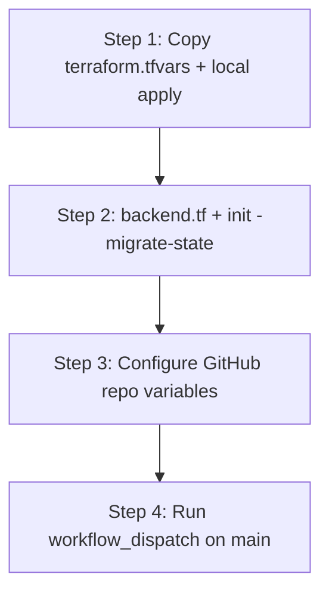

# terraform-infrastructure

[](LICENSE)

Bootstrap Terraform for Azure. This repository provisions the foundational resources that other Terraform workloads (including GitHub Actions pipelines) depend on before they can run safely with remote state and workload identity.

## Purpose

Most application or platform Terraform repos assume something already exists:

- An Azure Storage Account to store remote state
- A blob container for state files
- A user-assigned managed identity for deployments (typically from CI via OIDC)

This repo creates that foundation. It is the **first** Terraform stack you apply in a subscription/environment. Other repos then point their `backend "azurerm"` configuration at the storage account created here.

## What this stack creates

The `dev` environment currently provisions:

| Resource | Naming pattern | Purpose |
|----------|----------------|---------|
| Resource group | `rg-{github-repo-name}-{env}` | Container for bootstrap resources |
| Storage account | Derived from repo name + env (max 24 chars) | Remote Terraform state backend |
| Blob container | `tfstate` | Holds state files |
| User-assigned identity | `id-{github-repo-name}-{env}-deploy` | CI/CD deployments for this repo only |
| RBAC (Contributor) | Bootstrap resource group | Lets the deploy identity manage bootstrap resources |
| RBAC (Storage Blob Data Contributor) | State storage account | Lets the deploy identity read/write remote state |
| Federated identity credential | On deploy identity | Lets GitHub Actions on `main` authenticate via OIDC |

The storage account enables blob versioning, change feed, and 30-day soft delete for blobs and containers.

### State storage security (`allow_nested_items_to_be_public = false`)

The tfstate storage account sets **`allow_nested_items_to_be_public = false`**. This is important for a bootstrap backend:

- **What it does:** Prevents blobs (including state files) from being exposed via anonymous public read, even if someone later changes a container or blob ACL incorrectly.
- **Why it matters:** Remote state contains resource IDs, and often secrets or sensitive metadata. Public blob access on a state account is a common misconfiguration that leads to data exposure.
- **Defense in depth:** The `tfstate` container is already `private`, but account-level public access blocking closes a hole that container settings alone do not always prevent.

Do not set this to `true` on the Terraform state storage account unless you have a rare, documented requirement and additional controls.

Each GitHub repo that runs Terraform should follow the same pattern: its own deploy identity and RBAC scoped only to the resource groups and state storage that repo needs. This stack configures RBAC for **this** repository only.

## Naming conventions

| Layer | Convention |
|-------|------------|
| Resource group | `rg-{github-repo-name}-{env}` |
| Default environment | `dev` (use `prod` or others when added) |
| Subscription | Selected at runtime via Azure CLI or `ARM_SUBSCRIPTION_ID` — not stored in this repo |

Subscription IDs and other account-specific values belong in private configuration (gitignored `terraform.tfvars`, environment variables, or CI secrets), not in committed Terraform code.

## Repository structure

```
.
├── .github/
│   └── workflows/
│       └── terraform.yml          # Manual CI (workflow_dispatch); see below
├── .gitignore
├── LICENSE
├── README.md
└── environments/
    └── dev/
        ├── versions.tf              # Terraform/provider versions, provider config
        ├── variables.tf             # Input variables
        ├── locals.tf                # Naming locals
        ├── data.tf                  # Azure client config data source
        ├── main.tf                  # Bootstrap resources
        ├── rbac.tf                  # Role assignments for the deploy identity
        ├── oidc.tf                  # GitHub Actions federated identity credential
        ├── outputs.tf               # Values needed for backend config and CI setup
        ├── backend.tf.example       # Remote backend template (apply after first run)
        └── terraform.tfvars.example # Private config template (copy to terraform.tfvars)
```

## Prerequisites

- [Terraform](https://developer.hashicorp.com/terraform/downloads) `>= 1.5.0`
- [Azure CLI](https://learn.microsoft.com/en-us/cli/azure/install-azure-cli) logged in (`az login`)
- Permission to create resource groups, storage accounts, and managed identities in the target subscription
- Target subscription set before plan/apply:

```bash
az account set --subscription "<subscription-id>"
```

Or:

```bash
export ARM_SUBSCRIPTION_ID="<subscription-id>"
```

## Configuration

### Committed (safe for a public repo)

- Terraform resource definitions
- Example files: `terraform.tfvars.example`, `backend.tf.example`
- Generic naming defaults (for example, `github_repo_name = "terraform-infrastructure"`)

### Not committed (required locally / in CI)

| File / setting | Purpose |
|----------------|---------|
| `terraform.tfvars` | Environment-specific values (`location`, tags, etc.) |
| `backend.tf` | Remote state config for local runs (copy from `backend.tf.example`; gitignored) |
| `ARM_SUBSCRIPTION_ID` or `az account set` | Target Azure subscription |
| Azure credentials | `az login` locally, or OIDC managed identity in CI |
| GitHub repository variables | Azure IDs and backend settings for `.github/workflows/terraform.yml` |

Copy the example file to create private config:

```bash
cd environments/dev
cp terraform.tfvars.example terraform.tfvars
```

Edit `terraform.tfvars` and set at minimum:

- `github_owner` — your GitHub user or organization name (for OIDC)
- `location` — your Azure region

Do **not** commit `terraform.tfvars`, `backend.tf` (once populated), state files, or `.terraform.lock.hcl`. These are listed in `.gitignore`.

## Bootstrap workflow

This stack uses a **local state first** pattern. The storage account that will hold remote state does not exist until after the first apply, so the initial run cannot use the Azure backend yet.

Complete these **four steps in order**:

| Step | What | Where |
|------|------|--------|
| **1** | First apply (local state) | Your machine |
| **2** | Migrate state to Azure Storage | Your machine |
| **3** | Configure GitHub repository variables | GitHub repo settings |
| **4** | Run the Terraform workflow | GitHub Actions (`workflow_dispatch`) |



### Step 1 — First apply (local state)

From `environments/dev/`:

```bash
cp terraform.tfvars.example terraform.tfvars
# Edit terraform.tfvars (set location, etc.)

az login
az account set --subscription "<subscription-id>"

terraform init
terraform plan
terraform apply
```

At this stage you need **`terraform.tfvars`** but **not** `backend.tf`. State is stored locally in `terraform.tfstate` until you migrate.

Save the apply outputs — you will need them for the backend config and for future CI setup:

```bash
terraform output
```

Key outputs:

- `tfstate_storage_account_name` — for `backend.tf` and GitHub backend variables
- `resource_group_name` — for `backend.tf` and GitHub backend variables
- `deploy_identity_client_id` — GitHub variable `AZURE_CLIENT_ID`
- `tenant_id` — GitHub variable `AZURE_TENANT_ID` (sensitive output)
- `github_oidc_subject_main` — confirms OIDC trust is scoped to `main` on this repo

### Step 2 — Migrate to remote state

After the first apply succeeds:

```bash
cp backend.tf.example backend.tf
```

Edit `backend.tf` with values from `terraform output`:

- `resource_group_name` — from `resource_group_name` output
- `storage_account_name` — from `tfstate_storage_account_name` output
- `container_name` — `tfstate`
- `key` — e.g. `bootstrap/dev.tfstate`
- `use_azuread_auth` — `true` (required for CI and identity-based state access)

Then migrate state:

```bash
terraform init -migrate-state
```

Confirm the migration when prompted. State moves from the local file into the Azure storage account this stack created.

### Step 3 — Configure GitHub repository variables

Complete this **after Step 2**. Set these under **Settings → Secrets and variables → Actions → Variables** on your GitHub repository:

| Variable | Source |
|----------|--------|
| `AZURE_CLIENT_ID` | `terraform output -raw deploy_identity_client_id` |
| `AZURE_TENANT_ID` | `terraform output -raw tenant_id` |
| `AZURE_SUBSCRIPTION_ID` | Your subscription ID (`az account show --query id -o tsv`) |
| `AZURE_LOCATION` | Same value as `location` in your `terraform.tfvars` |
| `AZURE_BACKEND_RESOURCE_GROUP` | `terraform output -raw resource_group_name` |
| `AZURE_BACKEND_STORAGE_ACCOUNT` | `terraform output -raw tfstate_storage_account_name` |
| `AZURE_BACKEND_CONTAINER` | `tfstate` |
| `AZURE_BACKEND_KEY` | Same state key as `backend.tf` (e.g. `bootstrap/dev.tfstate`) |

Do not commit subscription IDs or other account-specific values to this repository. Store them only in gitignored local files or GitHub Actions variables/secrets.

The workflow generates a temporary `backend.tf` at runtime (with `use_azuread_auth = true`) and passes backend settings from these variables. `backend.tf` remains gitignored for local use.

### Step 4 — Run GitHub Actions (after Steps 1–3)

The workflow at `.github/workflows/terraform.yml` is included in this repo but **does not work until Steps 1–3 are complete**. The first apply must create the storage account and migrate state before CI can use a remote backend.

The workflow uses **`workflow_dispatch` only** — it does not run on every push. Run it manually from the GitHub Actions tab until you are ready to add `push`/`pull_request` triggers on `main`.

#### Why CI cannot run the bootstrap first apply

GitHub runners are ephemeral. The bootstrap stack starts with **local state** because the storage account does not exist yet. A CI job that applied bootstrap with local state would lose that state when the job finished. Run the first apply locally, migrate state, then use CI for ongoing changes.

#### OIDC trust (configured in Terraform)

`oidc.tf` creates a federated identity credential on the deploy managed identity. The subject is built from `github_owner` and `github_repo_name` (set in your `terraform.tfvars`), for example:

```text
repo:{github-owner}/{github-repo-name}:ref:refs/heads/main
```

Only workflows running on the **`main` branch** of this repo can authenticate as the deploy identity. Run the workflow from `main` after you merge these changes.

#### Run the workflow

1. Complete Steps 1–3.
2. Push this repo to GitHub and merge to `main`.
3. Open **Actions → Terraform → Run workflow**.
4. Choose `plan` or `apply`.

When you are ready for automatic runs, add triggers to `terraform.yml` (for example `push` and `pull_request` on `main`). Keep apply restricted to `main` to match the OIDC subject.

### Ongoing local use

After Step 2, you can also run Terraform locally without GitHub Actions:

- `terraform.tfvars`
- `backend.tf` (with real values)
- Azure authentication and subscription context

```bash
terraform plan
terraform apply
```

Local Terraform runs use your own Azure credentials (`az login`). GitHub Actions uses the deploy managed identity via OIDC once Steps 2–4 are complete.

## What is not included yet

- **Automatic CI triggers on push** — workflow is manual (`workflow_dispatch`) until you enable it
- **PR plan workflows** — would require an additional federated credential for `pull_request` subjects
- **Additional environments** — e.g. `environments/prod/` using the same patterns with `environment = "prod"`

## Adding another environment

To add `prod` (or another environment):

1. Copy `environments/dev/` to `environments/prod/`
2. Set `environment = "prod"` in that environment's `terraform.tfvars`
3. Use a distinct backend state key (e.g. `bootstrap/prod.tfstate`)
4. Run the same bootstrap workflow for that environment

Resource groups follow `rg-{github-repo-name}-{env}` (for example, `rg-terraform-infrastructure-prod`).

## Security notes

- Keep **`allow_nested_items_to_be_public = false`** on the state storage account (see [State storage security](#state-storage-security-allow_nested_items_to_be_public--false)).
- Never commit subscription IDs, storage account access keys, or populated `terraform.tfvars` / `backend.tf` files.
- Use `terraform.tfvars.example` and `backend.tf.example` as templates only.
- Review `terraform plan` before every apply.
- Restrict who can write to the state storage account; it contains sensitive infrastructure metadata.

## Troubleshooting

| Issue | Check |
|-------|-------|
| Wrong subscription | `az account show` or `terraform output subscription_id` after apply |
| Missing variables | Ensure `terraform.tfvars` exists and sets required values (e.g. `location`) |
| Backend init fails | Verify storage account name, RG name, and that you are authenticated |
| GitHub Actions auth fails | Confirm repo variables, that the workflow runs on `main`, and OIDC subject matches |
| GitHub Actions init fails | Complete Step 2 first; verify backend variable values match `terraform output` |
| Storage account name conflict | Names are globally unique; adjust `github_repo_name` or add a suffix strategy if needed |

## License

This project is licensed under the [MIT License](LICENSE).

Copyright (c) 2026 Yauchin M. Lam
